> *Carta para Mariona Riera Fernandez 26.03.2023*

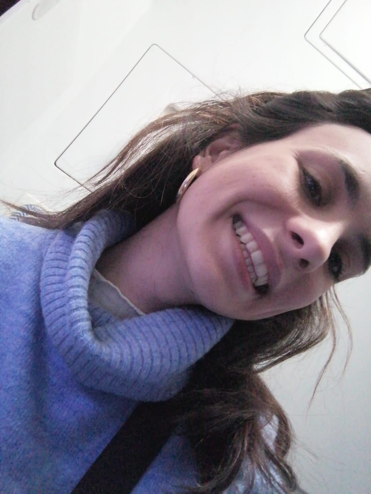

Marions, pasaste aquí conmigo unos $25$ días. Han sido preciosos. Desde tu partida he ido tristemente olvidando lo que significó para mi comprartir contigo esta aventura. Las preocupaciones las dudas me han ido alejando de apreciar aquello que es lo que quiero, a ti!

Por eso me he puesto a escribir estas líneas, para recordar, tener guardado y hacerte llegar los momentos bonitos, preciosos, entrañables y únicos que hemos vivido juntos.

---

## 14.02.2023

Llegaste un *14.02.2023*. Día de *San Valentin*. Nunca nos ha importado especialmente este día, aunque de alguna forma a mi me ha hecho siempre pararme a pensar y a preciar lo que significas para mí.

 Te esperé en el **Aereopuerto de Vaanta** con alguna hora de antelación. Tu vuelo se había restrasado y al final llegabas a las $18:00$ aprximadamente. Me dio tiempo a poder ir a comprar unas flores, un reno finlandés al `Clash Olson` y la compra de los días siguientes en el `Lidl`. Como no, había unos `noodles` esperándote esa noche. De `salmón`! Eso sí, estaba ahumado y lleno de sal así que tampoco supo especialemnte bien. Nos gustó más lo novedad que su sabor. Antes de cenar hicimos una `sauna` y pasamos la noche juntos curando un poco las heridas que se hacían algo más grandes los primeros días de tu llegada. 

---

## 15.02.2023

El fatídico día de `Helvar` vendría a poco de que llegaras. Tuve yo la genial idea de hacer una dinámica de grupo en una empresa de luces inteligentes que semanas antes nos había propuesto a los estudiantes de la asignatura de `Inteligent Buildings` participar en un vídeo promocional a cambio de unos `vouchers`. 

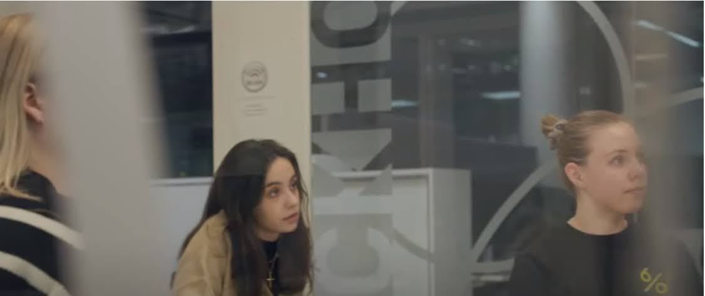

Fue una experiencia complicada podríamos decir, y tampoco ayudó mucho el echo de que veníamos algo tocados de la distancia. Las tareas que nos mandaron eran algo más difíciles de lo esperado y las direcciones en inglés no eran muy claras la mayoría de las veces. Esto unido a mi cabezonería de que *"es de mala ecucación hablar español cuando hay gente de otros países Mariona..."* hizo de ti este día algo `insufrible`.

Fuiste la útlima en hacerlo después de durante varios momentos haberte reservado las ganas de `llorar`. Yo te intentaba buscar la mirada pero no estabas para muchas tonterías que digamos. Finalmente saliste y lo hiciste bastante bien a pesar e que lo tuviste que repetir una vez más. Yo te expliqué mas o menos como era pero entre los nervios y la situación no funcionamos nada bien.

Tomamos unas pizzas todos juntos que al parecer te gustarion mucho, durante los días siguientes te preguntabas enfrente del escaparate de cualquier pizzería si se habrían comprado ahi.. Acabo la aventura en Helvar no sin antes habernos despedido de `Piños` después de que nos inidcase el camino correcto de manera un poco dudosa. 

Ahora es dónde empezaba el dialógo entre nosotros y el compartir lo que había pasado de manera un poco más intima:

*-* *"Aris no me hables que todavía tengo que procesar lo que acaba de pasar.."* 

*-* *"Sabes lo que nos han dado.. creo que son chuches? Venga Marions si no ha sido nada..."* 

*-* *"Me da igual Aris lo que nos han dado ya puedes ir tirándolo a la basura. Cómo me haces venir aquí??"* 

*-* *"Ostras Marions yo no sabía que iba a ser tan jodido..."*

Después de estar discutiendo de camino a `JMT 11` y andar bajo el frío llegamos a casa y de forma algo egoista me fui al gimnasio a ejercitar un poco la pierna. 

Llegué mas tarde, discutimos un poco más, nos sinceramos y nos acabamos riendo un poco del día que acababa de suceder... tampoco mucho.

---

## 16.02.2023

No recuerdo mucho este día, simplemte lo pasamos juntos comimos en alguna cantina del campus, disfrutamos el sabor del café y me hiciste compañía mientras preparaba mi presentanción del `TFM`. 

Quizás lo pasamos en las `burbujas` de la biblioteca mientras te mirabas una serie ..  o quizás me había encabezonado con la ventana de la biblioteca y te estarías viendo la película de `Los renclones torcidos de Dios` en algún sofá verde y yo me azercaba cada $20$ minutos para ver como iba la trama...

Por la tarde fuimos a disfrutar de nuestras entradas de `cine` y `palomitas`.

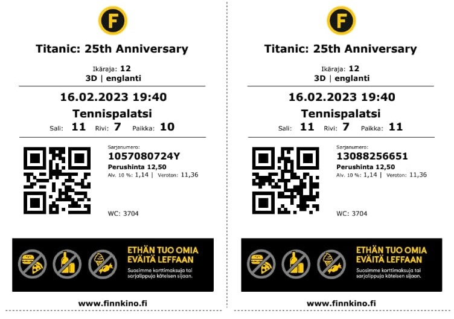

Después de disfrutar la peli la noche estaba clara. Tu venías con la sangre `mediterránea` corriendo todavía por tus venas y querías tomarte una `cerve`. Fue la primera y la última que tomamos en el `Old Irish`. Tu sangre mediterranea se fue congelando al mismo ritmo que la mía.

Una vez que llegamos al bar nos asomamos a nuestra mesa para ver dónde estaba grabado el $22$ nos tomamos unas cervezas y disfrutamos de la noche juntos.

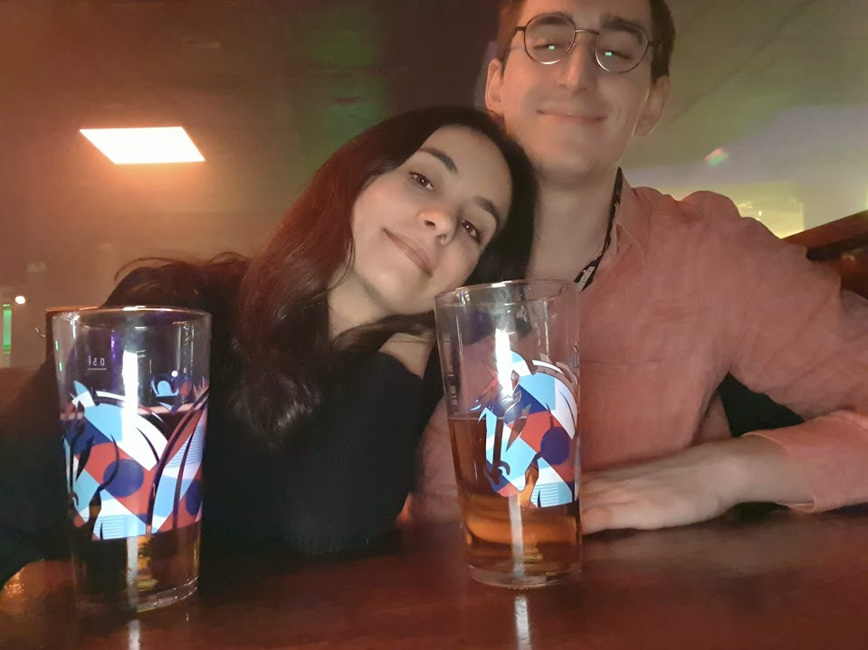

---

## 17.02.2023

El día $17$ tocaba explicarle a los `erasmus` **quién** era *Mariona Riera*. Teníamos el `evento` del `beer-pong` por la noche. Te pareció curioso que se jugase con agua, después de que pasaran los días y ver el precio de las cervezas te fue pareciendo poco a poco algo más normal.

Llegamos a la puerta y después de que vieras el panorama te `asustaste` y decidiste volver. Veníamos un poco tocados después de lo de `Helvar` y claro a saber dónde te metía Aris esta vez. 

Tuviste la mala suerte o bueno.. buena suerte, de que alguién te saludó por la ventana. Me miraste y me disjte: 

*-* *"Aris ya me han visto, vamos a entrar... madre mía dónde me estoy metiendo"*

Entramos, saludamos a la gente y todo poco a poco perecías más fácil.

Y tan fácil que a pesar de perder el primer partido contra `Aes` y `Alicia` les pudimos ganar en la final. 

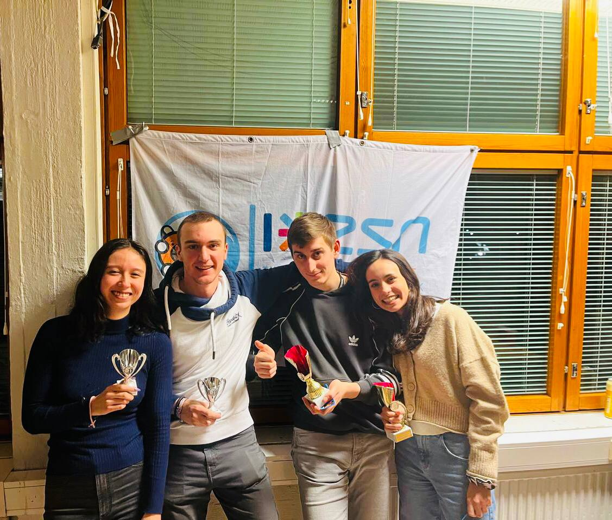

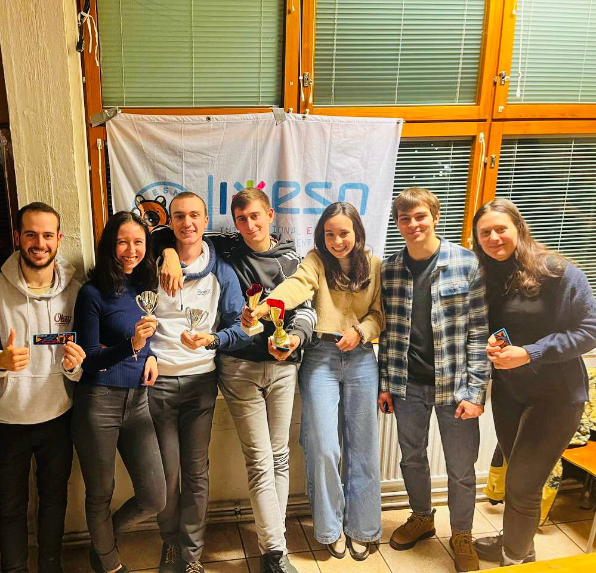

### El tiro de la victoria
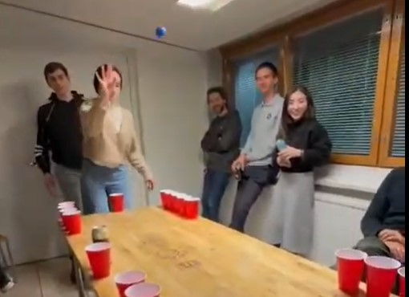

De camino a casa por alguna razón que hoy no recuerdo uno de los $2$ `trofeos` terminó en la `basura`. El otro hoy está en mi apartamento junto a una de las `botellas` que nos regalaron los de Helvar.

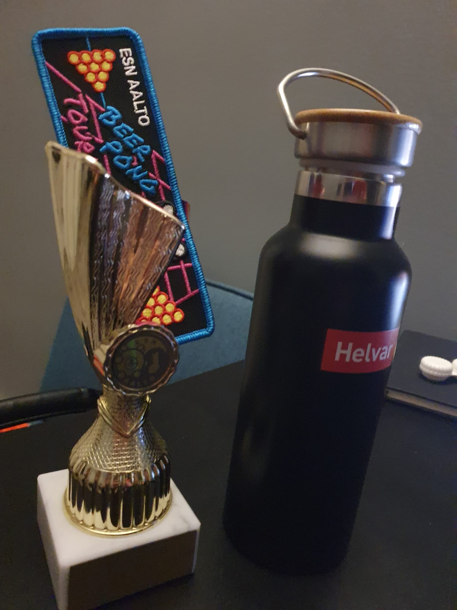

---
## 18.02.2023

## 19.02.2023
### Nuksio

## 20.02.2023

## Nikolai

## Notion Stockholm y biblioteca, comimos en Helsinki

## 21.02.2023

### Sauna 10 G JMT

## 22.02.2023

### Alien Sitsit

## 23.02.2023

### Unisport

### Sauna 11 E

## 24.02.2023

### Finniko Whitney

Algún día entenderé tu capacidad de `catar palomitas` y saber cuáles son las buenas y cuales las malas y darte las gracias por ese precioso don, de momento solo me scada de mis `casillas`.

Nunca sabremos Marions cómo sabrá aquella `pizza` que nunca pedimos. Eso sí nuetro dolor de tripa empezo a cocinarse en estas escapadas al `Finniko` y el exceso de chuches y la ingesta de paloitas algo crudas. 

## 25.02.2023

### Sauna 10 E

## 26.02.2023

Nos levantamos y el objetivo era hacer los bocatas. Yo tenía trabajo que hacer asi que amablemente te pusiste tu manos a la obra. 

De vez en cuando desde la cocina me hablabas hasta que el `silencio` se mezclo con el olor a `quemado`.

Salimos, cogimos el `52` y luego el tram hasta el puerto. Yo iba algo `mosqueado` y tu me soportabas con cariño. Nuestro viaje a `Estocolmo` comenzaba!

De camino al puerto nos confiamos demasiado y por un momento casi nos quedamos subidos en el `tram`, se estaba cómodo y disfrutábamos de la mutua compañía. Suerte que vimos bajar a la gente y la seguimos hasta el `puerto`. Una vez llegamos vimos como `Gabriella` allí descansaba.

Entramos en el puerto y conseguimos hacer el cheking, yo me quejé un par de veces durante el camino de lo mal que estaba explicado todo, mientras tu te reías de `el rata`. Fuimos al baño y entramos en la zona de descanso al lado de la puerta de embarque.

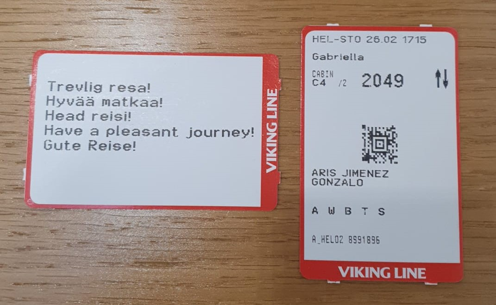

Una vez dentro del barco tardamos algo en encontrar nuestra cabina, daba algo de miedo pues nos imponía tener que bajar tantas escaleras. La verdad que después de haber visto hace unos días la peli de `Titanic` nada parecía una buena idea. Depués de vacilar un par de veces y bloquearle el paso a un `cojo` cogimos el camino que más seguridad nos daba. A todo esto, nuestro compañero de pasillo era un `DiCaprio negro` que vestía con mucho `flow`. 

Depués de asentarnos y disfrutar de ´nuestro pequeño rincón´ nos aventuramos a descubir los rincones de `Gabriela`.

Recorrimos la `eslora` por la `cubierta` de `popa` a `proa`, esta vez no buscaba dar de comer a los `peces del retiro` pero aún así me resbalé y cahí contra el suelo. La sombra de la tarde se escondía por `babor` y la nieve que quedaba se congelaba formando una pequeña pista de `patinaje`.

Mi cabezonería te hizo pasar miedo. Me tranquilicé y entramos a comprar unas `patatas` para saciar el hambre y mi ansiedad.

Recorrimos el barco buscando un `lobby` imaginario hasta que encontramos un sitio algo recogido alejado de los borrachos. Allí compartimos una `cerve` mientras discutíamos el mensaje que le tenías que dejar a `Leti`, suerte que tu `padre` te llamó y te dejó algo de claridad mientras unos animadores mostraban en las pantallas esquinas de objetos a adivinar.

 Más tarde cenamos nuestros bocatas que `quemaste` por despiste la noche de antes pero que hiciste con tanto cariño que nos sentó bien.

No tardamos en bajar al `camarote` desearnos las buenas noches y después de pensar en avisar a `recepción` nos quedamos dormidos pensando en quizás otras preocupaciones mientras, eso si, un `artefacto` soplaba un aire aparentemente vennigno a los pies de nuestras camas.
 
## 27.02.2023

Por la mañana nos terminamos nuestras preciadas rosquillas que a día de hoy miro con cariño en el `K-Market`.

Toqué algunos botones de la `radio` del barco mientras resolvíamos el misterio del `soplo` nocturo y compartíamos como el barco durante la noche había acelerado el paso. 

Salimos del cuarto con las maletas y cerca de un ventanal del barco vimos cómo `atracábamos` en la ciudad de Estocolmo. Era gracioso ya que cada vez que mirábamos a la derecha nuestros compañeros de ventana que descansaban en `sillas acolchadas` cambiaban y venían otros nuevos mientras nosotros nos contentábamos con apoyarnos en la rapisa y no pensar mucho en la comodidad.

Dejamos atrás `Viking-Line` sorteando a los perros de seguirdad que se te acercaron quizás por la sorpresa de ver una chica tan guapa en la capital sueca. 

Yo tenía la aplicación `SL` descargada pero también llevaba conmigo lo inquietud por suscibirme a un servicio nada rentable de trasnporte público. Optamos por coger un bus que estaba a algo lejos de la terminal. Desenfundé la aplicación y justo nos dió tiempo a entrar y llegar a `Slussen`la estación de metro más cercana con conexión directa con `Rådmansgatan`.

Llegamos pronto a lo que sería nuestro hugar durante las $2$ próximas noches. Quizás pueda parecer osado llamarle al `Rex-Petit` hogar, pero a veces es lo que uno sentía cuando al bajar por las escaleras de piedra pisaba finalmente la moqueta roja del pasillo. 

Como era de esperar no pudimos todavía ir a nuestro cuarto, nos tomamos un `café`, dejamos las maletas y nos fuimos a pasear por `Glam Stan`.

A las $12:00$ después de haber disfrutado algo las calles `nuevas` y `viejas` del barrio antiguo nos asomamos al palacio real. Pudimos ver el cambio de guardia, no sorprendió lo justo. y decidimos ir a comer al `Kitchen-Mama`.

Antes paramos por una iglesia con símbolos `masónicos` y por el `mercado` de la ciudad, dónde te sroprendiste más que por el mercado por la suerte que teníamos de haberlo visto ya que según tus planes era complicado asomarse a ese rincón sueco.

Llegamos al bar, nos pedimos unas `albóndigas` con puré de `patata` y salsa de `frutos rojos`, ellos lo llaman `Köttbullar` y saciamos nuestra hambre con una ensalada y una rebanada de pan `sueco-seco`.

Después nos acercamos al hotel, dejamos las cosas en la habitación, descansamos un poco y saludamos a `Valentín`.

Valentín

Laneta Mex

# 28.02.2023

El `Museo Medieval` era un parque temático para niños dónde hicimos un extraño viaje al pasado al medievo nórdico dónde reinaba el sufrimiento y el trabajo manual.

Comida en Glan Stan

Pizzería Turca
## Fire Horse

Por la noche nos acercamos

 

## 01.02.2023

El último día en Estocolmo discutimos varias opciones. Nos levatamos algo cansados del viaje y te propuse varias: 
1. Hacer un free tour en `inglés` con un audio guía
2. Ir a una galería de arte algo perdida al otro lado de la ciudad
3. Y otro plan que no recuerdo

Me sorprendió que aceptaste la primera opción, tanto que al final acabamos haciendo la segunda. 

Una vez después de volver asormarnos a la gran ventana de la ciudad de `Estocolmo` llamada `Mariabeget` fuimos a disfrutar de la galería de arte.

Entramos, y una mujer risueña nos dió la bienvenida. En la primera planta había fotos de `sapos`, `lombrices` y `plantas`, en la de abajo fotos de todo tipo que quizás significaron algo para alguién algún día.

Salimos de la galería, nos dio la luz del Sol y los dos notamos como nos pusimos más contentos. Después de mostrar indecisión por sortear las calles de la ciudad nos cruzamos con el  `Bastard Burguer`. Allí nos quedamos, decidimos no sentarnos al lado del baño, pedimos un menu del día, yo pedí un `zumo` y tu una bebida de `limon` que ya solo agarrar la lata te desagradaba.

Después de despedir la ciudad fuimos en `metro` al `Rex Petit`, le dijimos adios y fuimos directos a la estación central. Fue una sopresa el viaje al aereopuerto pues parecía una `gymcana`: puertas giratorias, pasadizos, señales en recovecos.... finalmente llegamos. 

Una `señora sueca` atendía a los tripulantes del bus, todos agraviados pidiendo explicaciones y ahorrandose el "gracias". Tu si que diste las gracias cuando preguntaste si el bus tenía `baño`. No lo tenía y pagar una vez más por un servicio que encontramos en la segunda planta no nos pareció buena idea. 

El bus tardó poco en llegar, y yo poco en dormirme. Tu encendiste muy amablemente el `Google Maps` para despertarme justo en el momento preciso. Fue milimetrado el `timing`  a pesar de la prefección a mí me siguió molestando. 

Bajamos del bus y por las obras tuvimos que andar hacia una terminal `T-5` algo alejada parando antes por el servicio.

Una vez que pasamos el control de seguridad y que tu hibieras sorteado el `mal humor` de uno o incluso varios `seguratas` decidimos lavarnos los dientes. Encontramos un baño en una zona de paso y mientras yo me epeñana en ir al `Max` más tarde a por una hamburguesa tu sorteabas mi impaciencia con cariño. 

Subimos a la zona de espera y yo tuve que llamar a mi `seguro`. A día de hoy parece que ya está todo solucionado pero las recepcionistas finlandesas me acaban siempre de alguna forma dándome largas y no dejando nada claro. El problema no viene de que una recepciosita sea desconfiada, todas actúan igual.. es bastante curioso. 

Mientras yo llamaba tu veías sentada rodeada de maletas el directo de `PlanEir` al que yo tardé poco en engancharme. Aquella chica `gaditana` que estudiaba en un `cortijo`, se daba el placer de acariciar a su `perra` ocasionalmente, seguía los pasos de su hermana mayor, recopilaba preguntas secretas y asistía los domingos a misa te hizo a ti desempolvar memorias y a mí un poco también.

El tiempo pasaba enfrente de la puerta $16$ del *Aereopuerto de Arlanda* y no nos dimos cuenta. Nos suele pasar en los aereopuertos. Una vez que llegamos le perdemos a importancia a que tenemos que `volver a casa`, ya nos pasó en Italia. Estamos juntos, el tiempo se para, `todo da igual` Marions.  

Finalmente con $5$ minutos de antelación nos metimos en nuestra nave aérea y volvimos desde la `ciudad` de Estocolmo al `pueblo` de Helsinki. 

Una vez llegamos a `Helsinki` yo lo sentía todo más como casa y tu algo también.

Compramos pollo aliñado con especias.

## 02.03.2023

El día $2$  faltabn $2$ días para. A pesar de eso me supiste querer muy bien y me acompñaste en mi aventura con `Phalo`. Gracias por tu apoyo Marions. Pasamos la tarde en `Marintalo` mientras tu te veías el comienzo de la peli de `Malcom y Marie`. 

Por la noche nos recogimos depués de saludar a `Pablo` y `Ariana`, que se acercaron a dónde estábamos para avanzar un poco con el vídeo. A día de hoy ya está grabado y nuestro abrazo del campeonato de `beer-pong` aparece al final. 

Me quedé un rato con ellos, pero se hacía tarde y nos acercamos al `Alepa` y `K-market`a comprar yo la cena y tu $2$ cervezas. Fue una pena que no pudiéramos comprar las cerves pues se nos había hecho bastante tarde. Tu no entedías el por qué y te empeñaste en probar en el otro super apesar de que la `ley finlandesa` funciona por igual y sobre todo aquí que todo se cumple muy a rajatabla.

Por la noche disfrutamos juntos de la peli con dos pizzas, gracias en pensar en compartirla conmigo. Una de las pizzas era de `atún`, me acanta como siempre estás atenta a la `pizza que más me gusta` para `reservarme` el último pedazo, piensas mucho en mi Marions... fue un día bastante bonito, dónde lo que más sentí a lo largo de él fue `tu apoyo` y `tu amorjpg)`.  

Por la noche nos recogimos y quedamos rendidos del cansancio.

[Cosas que no se pueden describir]

Podcast. Maravilloso Marintalo

Noche incréible

---
## 03.03.2023

Que suerte que el día antes de que te marcharas pudiérmos ir al `Kiasma` y al `Museo Nacional`. Son dos exposiciones de Helsinki que disfruto un montón y el primer viernes de cada mes las dos son gratuitas.

Por la mañana me dediqué a finiquitar algunos detalles de mi `TFM` mientras tu a mi espalda recogías tus cosas y me dejabas una nota escrita.

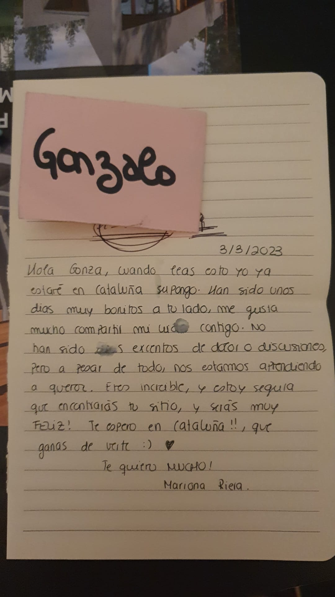

Llegamos al `Museo Nacional` e intenté enseñarte la historia de *Santa Barbára* mientras apartábamos a una madre y su hijo del `retablo`. Mas o menos adivinaste la historia pero mi insistencia hacía de la situación algo incómodo.

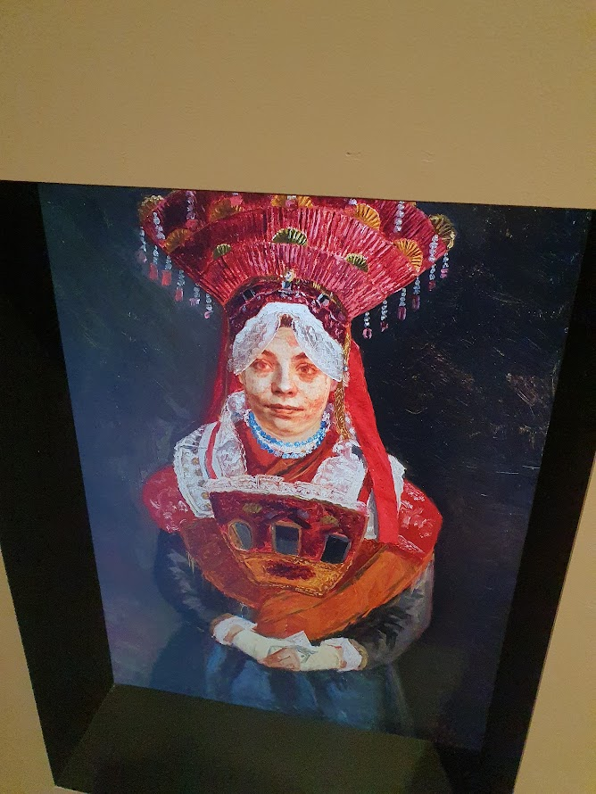

Mi impaciencia absurda nos hizo que llegáramos al segundo museo casi una hora antes. Estuvo bien pues pedimos sitio en el `free tour` y nos fuimos al piso de arriba a tumbarnos en los `cojines` mientras contemplábamos como se apagaba poco a poco la capital del `frío`. 

No solo era tu `primer día` en el museo sino también el de la chica que nos enseñaba el lugar. 

Nos mostró y explico varias obras con voz algo `temblorosa`. Al marcharnos nos la encontramos en las escaleras y al despedirla pudimos notar en su mirada cierto gesto de `preocupación`.

Una de las obras que más me llamó la atención a parte de verte a ti paseando por el museo, fue el `zológico` que se mostraba en una de las salas. Entre una biblia y el `coran` había dispuesto un sinfín de animales. Antes de que llegaras tenía la idea de pasar juntos un día en el zoo, finalmente lo vislumbramos dentro ed una obra de arte. 

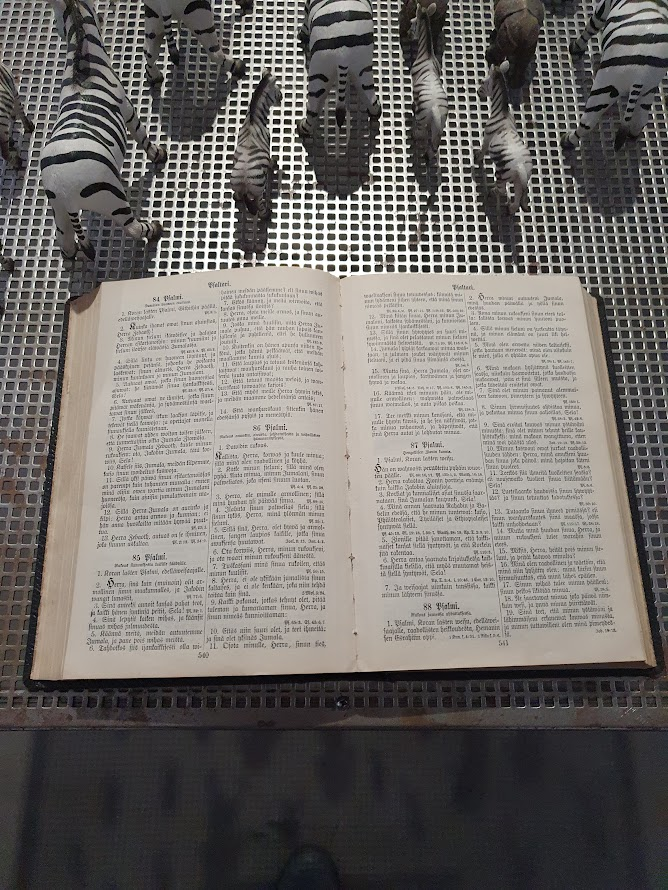

El día terminó volviendo juntos a disfrutar de la última sauna en Helsinki. Cenamos algo que nos sentó lo suficientemente bien para fundirnos en `besos` en nuestra `última noche.`

Sauna de cerveza gozo. Marions. Se nos pasó rápido.

---

## 04.03.2023

Antes de que te fueras me empeñé en comer en `Abloc` y claro.. allí que fuimos. 

Nos `separamos` un momento, tu llevabas la maleta pesada y no nos salía retable comprar el billete en ese moemento. Te quedaste esperando al bus con todas tus pertenencias y más tardé me curcé contigo. `Arrastrabas` la maleta hacía el metro y en ese momento se me hizo más real que nunca que te `marchabas`. 

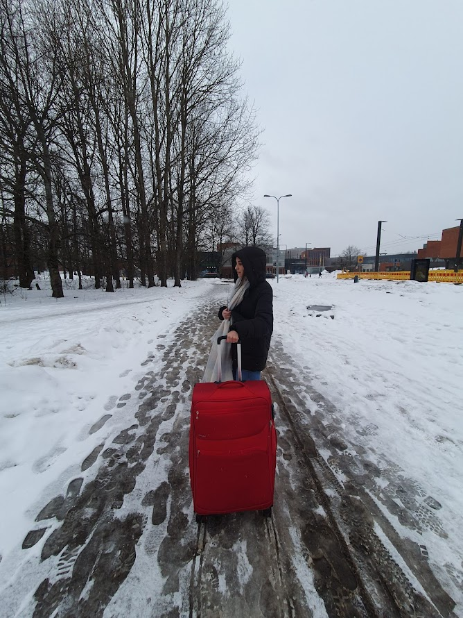

Llegamos finalmente a la cantina, vimos en la puerta a algunos de mis amigos, les despedimos y entramos a comer. 

Una vez entramos tuviste un momento a solas con `Samuel` que venía con el pelo despeinado y alguna mancha de `ketchup` en la cara. Mientras él te hablaba te girabas buscándome, llegué por tu espalda, le saludamos, pasamos el momento incómodo desde el humor de la situción y finalmente buscamos un sitio para tener nuestra última comida. El `eslovaco` mientras tanto se iba en busca de aquello que le daba el gusto por vivir, *esos pequeños momentos que nos rodean*. 

Te pediste una pizza, a la que le quitaste la `piña` y con `suerte` de masa fina yo unos nachos un poco raros que estaban ricos pero no quedaban muchos.

`Younnis` estaba cerca nuestro viendo la `F1`. Aquel `mountruo` nocturno que daba miedo que de un día a otro apareciese en la cocina del apartamento de `183 de JMT 11 I ` reposaba ahí finalmente.

Comimos, me viste con cara de que me había quedado con hambre y me ofreciste un pedazo de tu pizza y marchamos al aereopuerto con algo de antelación.

Llegamos a *Vantaa*, antes de despedirnos me empezó a sangrar la `nariz`. Nos apartamos a un lado, hablamos un poco de cosas sin más para no darle mucha importancia al hecho de que te ibas y finalmente `te fuiste`.

Mis lagrimas me acompañaron hasta que me llamaste cuando ya estaba en `Rautatientori` bajando del `VR` y me decías que te ofrecían $400$ euros y todo pagado por quedarte una noche más. Parecía que podíamos alargar un poquito más nuestra historia de amor en `Helsinki`. La indecisión y el tiempo fueron en nuetra contra, así que te marchaste. 

Mis lagrimas no volvieron a `brotar` pues se habían secado y quebrado con la falsa esperanza de que volvieras. A partir de ahí me quise como olvidar de lo que habías significado para mí esos días.

---

# Final

> *Carta para Mariona Riera Fernandez 26.03.2023*

Marions, pasaste aquí conmigo unos $25$ días. Han sido preciosos. Desde tu partida he ido tristemente olvidando lo que significó para mi comprartir contigo esta aventura. Las preocupaciones las dudas me han ido alejando de apreciar aquello que es lo que quiero, a ti!

Por eso me he puesto a escribir estas líneas, para recordar, tener guardado y hacerte llegar los momentos bonitos, preciosos, entrañables y únicos que hemos vivido juntos.

---

## 14.02.2023

Llegaste un *14.02.2023*. Día de *San Valentin*. Nunca nos ha importado especialmente este día, aunque de alguna forma a mi me ha hecho siempre pararme a pensar y a preciar lo que significas para mí.

 Te esperé en el **Aereopuerto de Vaanta** con alguna hora de antelación. Tu vuelo se había restrasado y al final llegabas a las $18:00$ aprximadamente. Me dio tiempo a poder ir a comprar unas flores, un reno finlandés al `Clash Olson` y la compra de los días siguientes en el `Lidl`. Como no, había unos `noodles` esperándote esa noche. De `salmón`! Eso sí, estaba ahumado y lleno de sal así que tampoco supo especialemnte bien. Nos gustó más lo novedad que su sabor. Antes de cenar hicimos una `sauna` y pasamos la noche juntos curando un poco las heridas que se hacían algo más grandes los primeros días de tu llegada. 

---

## 15.02.2023

El fatídico día de `Helvar` vendría a poco de que llegaras. Tuve yo la genial idea de hacer una dinámica de grupo en una empresa de luces inteligentes que semanas antes nos había propuesto a los estudiantes de la asignatura de `Inteligent Buildings` participar en un vídeo promocional a cambio de unos `vouchers`. 

Fue una experiencia complicada podríamos decir, y tampoco ayudó mucho el echo de que veníamos algo tocados de la distancia. Las tareas que nos mandaron eran algo más difíciles de lo esperado y las direcciones en inglés no eran muy claras la mayoría de las veces. Esto unido a mi cabezonería de que *"es de mala ecucación hablar español cuando hay gente de otros países Mariona..."* hizo de ti este día algo `insufrible`.

Fuiste la útlima en hacerlo después de durante varios momentos haberte reservado las ganas de `llorar`. Yo te intentaba buscar la mirada pero no estabas para muchas tonterías que digamos. Finalmente saliste y lo hiciste bastante bien a pesar e que lo tuviste que repetir una vez más. Yo te expliqué mas o menos como era pero entre los nervios y la situación no funcionamos nada bien.

Tomamos unas pizzas todos juntos que al parecer te gustarion mucho, durante los días siguientes te preguntabas enfrente del escaparate de cualquier pizzería si se habrían comprado ahi.. Acabo la aventura en Helvar no sin antes habernos despedido de `Piños` después de que nos inidcase el camino correcto de manera un poco dudosa. 

Ahora es dónde empezaba el dialógo entre nosotros y el compartir lo que había pasado de manera un poco más intima:

*-* *"Aris no me hables que todavía tengo que procesar lo que acaba de pasar.."* 

*-* *"Sabes lo que nos han dado.. creo que son chuches? Venga Marions si no ha sido nada..."* 

*-* *"Me da igual Aris lo que nos han dado ya puedes ir tirándolo a la basura. Cómo me haces venir aquí??"* 

*-* *"Ostras Marions yo no sabía que iba a ser tan jodido..."*

Después de estar discutiendo de camino a `JMT 11` y andar bajo el frío llegamos a casa y de forma algo egoista me fui al gimnasio a ejercitar un poco la pierna. 

Llegué mas tarde, discutimos un poco más, nos sinceramos y nos acabamos riendo un poco del día que acababa de suceder... tampoco mucho.

---

## 16.02.2023

No recuerdo mucho este día, simplemte lo pasamos juntos comimos en alguna cantina del campus, disfrutamos el sabor del café y me hiciste compañía mientras preparaba mi presentanción del `TFM`. 

Quizás lo pasamos en las `burbujas` de la biblioteca mientras te mirabas una serie ..  o quizás me había encabezonado con la ventana de la biblioteca y te estarías viendo la película de `Los renclones torcidos de Dios` en algún sofá verde y yo me azercaba cada $20$ minutos para ver como iba la trama...

Por la tarde fuimos a disfrutar de nuestras entradas de `cine` y `palomitas`.

Después de disfrutar la peli la noche estaba clara. Tu venías con la sangre `mediterránea` corriendo todavía por tus venas y querías tomarte una `cerve`. Fue la primera y la última que tomamos en el `Old Irish`. Tu sangre mediterranea se fue congelando al mismo ritmo que la mía.

Una vez que llegamos al bar nos asomamos a nuestra mesa para ver dónde estaba grabado el $22$ nos tomamos unas cervezas y disfrutamos de la noche juntos.

---

## 17.02.2023

El día $17$ tocaba explicarle a los `erasmus` **quién** era *Mariona Riera*. Teníamos el `evento` del `beer-pong` por la noche. Te pareció curioso que se jugase con agua, después de que pasaran los días y ver el precio de las cervezas te fue pareciendo poco a poco algo más normal.

Llegamos a la puerta y después de que vieras el panorama te `asustaste` y decidiste volver. Veníamos un poco tocados después de lo de `Helvar` y claro a saber dónde te metía Aris esta vez. 

Tuviste la mala suerte o bueno.. buena suerte, de que alguién te saludó por la ventana. Me miraste y me disjte: 

*-* *"Aris ya me han visto, vamos a entrar... madre mía dónde me estoy metiendo"*

Entramos, saludamos a la gente y todo poco a poco perecías más fácil.

Y tan fácil que a pesar de perder el primer partido contra `Aes` y `Alicia` les pudimos ganar en la final. 

### El tiro de la victoria

De camino a casa por alguna razón que hoy no recuerdo uno de los $2$ `trofeos` terminó en la `basura`. El otro hoy está en mi apartamento junto a una de las `botellas` que nos regalaron los de Helvar.

---
## 18.02.2023

## 19.02.2023
### Nuksio

## 20.02.2023

## Nikolai

## Notion Stockholm y biblioteca, comimos en Helsinki

## 21.02.2023

### Sauna 10 G JMT

## 22.02.2023

### Alien Sitsit

## 23.02.2023

### Unisport

### Sauna 11 E

## 24.02.2023

### Finniko Whitney

Algún día entenderé tu capacidad de `catar palomitas` y saber cuáles son las buenas y cuales las malas y darte las gracias por ese precioso don, de momento solo me scada de mis `casillas`.

Nunca sabremos Marions cómo sabrá aquella `pizza` que nunca pedimos. Eso sí nuetro dolor de tripa empezo a cocinarse en estas escapadas al `Finniko` y el exceso de chuches y la ingesta de paloitas algo crudas. 

## 25.02.2023

### Sauna 10 E

## 26.02.2023

Nos levantamos y el objetivo era hacer los bocatas. Yo tenía trabajo que hacer asi que amablemente te pusiste tu manos a la obra. 

De vez en cuando desde la cocina me hablabas hasta que el `silencio` se mezclo con el olor a `quemado`.

Salimos, cogimos el `52` y luego el tram hasta el puerto. Yo iba algo `mosqueado` y tu me soportabas con cariño. Nuestro viaje a `Estocolmo` comenzaba!

De camino al puerto nos confiamos demasiado y por un momento casi nos quedamos subidos en el `tram`, se estaba cómodo y disfrutábamos de la mutua compañía. Suerte que vimos bajar a la gente y la seguimos hasta el `puerto`. Una vez llegamos vimos como `Gabriella` allí descansaba.

Entramos en el puerto y conseguimos hacer el cheking, yo me quejé un par de veces durante el camino de lo mal que estaba explicado todo, mientras tu te reías de `el rata`. Fuimos al baño y entramos en la zona de descanso al lado de la puerta de embarque.

Una vez dentro del barco tardamos algo en encontrar nuestra cabina, daba algo de miedo pues nos imponía tener que bajar tantas escaleras. La verdad que después de haber visto hace unos días la peli de `Titanic` nada parecía una buena idea. Depués de vacilar un par de veces y bloquearle el paso a un `cojo` cogimos el camino que más seguridad nos daba. A todo esto, nuestro compañero de pasillo era un `DiCaprio negro` que vestía con mucho `flow`. 

Depués de asentarnos y disfrutar de ´nuestro pequeño rincón´ nos aventuramos a descubir los rincones de `Gabriela`.

Recorrimos la `eslora` por la `cubierta` de `popa` a `proa`, esta vez no buscaba dar de comer a los `peces del retiro` pero aún así me resbalé y cahí contra el suelo. La sombra de la tarde se escondía por `babor` y la nieve que quedaba se congelaba formando una pequeña pista de `patinaje`.

Mi cabezonería te hizo pasar miedo. Me tranquilicé y entramos a comprar unas `patatas` para saciar el hambre y mi ansiedad.

Recorrimos el barco buscando un `lobby` imaginario hasta que encontramos un sitio algo recogido alejado de los borrachos. Allí compartimos una `cerve` mientras discutíamos el mensaje que le tenías que dejar a `Leti`, suerte que tu `padre` te llamó y te dejó algo de claridad mientras unos animadores mostraban en las pantallas esquinas de objetos a adivinar.

 Más tarde cenamos nuestros bocatas que `quemaste` por despiste la noche de antes pero que hiciste con tanto cariño que nos sentó bien.

No tardamos en bajar al `camarote` desearnos las buenas noches y después de pensar en avisar a `recepción` nos quedamos dormidos pensando en quizás otras preocupaciones mientras, eso si, un `artefacto` soplaba un aire aparentemente vennigno a los pies de nuestras camas.
 
## 27.02.2023

Por la mañana nos terminamos nuestras preciadas rosquillas que a día de hoy miro con cariño en el `K-Market`.

Toqué algunos botones de la `radio` del barco mientras resolvíamos el misterio del `soplo` nocturo y compartíamos como el barco durante la noche había acelerado el paso. 

Salimos del cuarto con las maletas y cerca de un ventanal del barco vimos cómo `atracábamos` en la ciudad de Estocolmo. Era gracioso ya que cada vez que mirábamos a la derecha nuestros compañeros de ventana que descansaban en `sillas acolchadas` cambiaban y venían otros nuevos mientras nosotros nos contentábamos con apoyarnos en la rapisa y no pensar mucho en la comodidad.

Dejamos atrás `Viking-Line` sorteando a los perros de seguirdad que se te acercaron quizás por la sorpresa de ver una chica tan guapa en la capital sueca. 

Yo tenía la aplicación `SL` descargada pero también llevaba conmigo lo inquietud por suscibirme a un servicio nada rentable de trasnporte público. Optamos por coger un bus que estaba a algo lejos de la terminal. Desenfundé la aplicación y justo nos dió tiempo a entrar y llegar a `Slussen`la estación de metro más cercana con conexión directa con `Rådmansgatan`.

Llegamos pronto a lo que sería nuestro hugar durante las $2$ próximas noches. Quizás pueda parecer osado llamarle al `Rex-Petit` hogar, pero a veces es lo que uno sentía cuando al bajar por las escaleras de piedra pisaba finalmente la moqueta roja del pasillo. 

Como era de esperar no pudimos todavía ir a nuestro cuarto, nos tomamos un `café`, dejamos las maletas y nos fuimos a pasear por `Glam Stan`.

A las $12:00$ después de haber disfrutado algo las calles `nuevas` y `viejas` del barrio antiguo nos asomamos al palacio real. Pudimos ver el cambio de guardia, no sorprendió lo justo. y decidimos ir a comer al `Kitchen-Mama`.

Antes paramos por una iglesia con símbolos `masónicos` y por el `mercado` de la ciudad, dónde te sroprendiste más que por el mercado por la suerte que teníamos de haberlo visto ya que según tus planes era complicado asomarse a ese rincón sueco.

Llegamos al bar, nos pedimos unas `albóndigas` con puré de `patata` y salsa de `frutos rojos`, ellos lo llaman `Köttbullar` y saciamos nuestra hambre con una ensalada y una rebanada de pan `sueco-seco`.

Después nos acercamos al hotel, dejamos las cosas en la habitación, descansamos un poco y saludamos a `Valentín`.

Valentín

Laneta Mex

# 28.02.2023

El `Museo Medieval` era un parque temático para niños dónde hicimos un extraño viaje al pasado al medievo nórdico dónde reinaba el sufrimiento y el trabajo manual.

Comida en Glan Stan

Pizzería Turca
## Fire Horse

Por la noche nos acercamos

 

## 01.02.2023

El último día en Estocolmo discutimos varias opciones. Nos levatamos algo cansados del viaje y te propuse varias: 
1. Hacer un free tour en `inglés` con un audio guía
2. Ir a una galería de arte algo perdida al otro lado de la ciudad
3. Y otro plan que no recuerdo

Me sorprendió que aceptaste la primera opción, tanto que al final acabamos haciendo la segunda. 

Una vez después de volver asormarnos a la gran ventana de la ciudad de `Estocolmo` llamada `Mariabeget` fuimos a disfrutar de la galería de arte.

Entramos, y una mujer risueña nos dió la bienvenida. En la primera planta había fotos de `sapos`, `lombrices` y `plantas`, en la de abajo fotos de todo tipo que quizás significaron algo para alguién algún día.

Salimos de la galería, nos dio la luz del Sol y los dos notamos como nos pusimos más contentos. Después de mostrar indecisión por sortear las calles de la ciudad nos cruzamos con el  `Bastard Burguer`. Allí nos quedamos, decidimos no sentarnos al lado del baño, pedimos un menu del día, yo pedí un `zumo` y tu una bebida de `limon` que ya solo agarrar la lata te desagradaba.

Después de despedir la ciudad fuimos en `metro` al `Rex Petit`, le dijimos adios y fuimos directos a la estación central. Fue una sopresa el viaje al aereopuerto pues parecía una `gymcana`: puertas giratorias, pasadizos, señales en recovecos.... finalmente llegamos. 

Una `señora sueca` atendía a los tripulantes del bus, todos agraviados pidiendo explicaciones y ahorrandose el "gracias". Tu si que diste las gracias cuando preguntaste si el bus tenía `baño`. No lo tenía y pagar una vez más por un servicio que encontramos en la segunda planta no nos pareció buena idea. 

El bus tardó poco en llegar, y yo poco en dormirme. Tu encendiste muy amablemente el `Google Maps` para despertarme justo en el momento preciso. Fue milimetrado el `timing`  a pesar de la prefección a mí me siguió molestando. 

Bajamos del bus y por las obras tuvimos que andar hacia una terminal `T-5` algo alejada parando antes por el servicio.

Una vez que pasamos el control de seguridad y que tu hibieras sorteado el `mal humor` de uno o incluso varios `seguratas` decidimos lavarnos los dientes. Encontramos un baño en una zona de paso y mientras yo me epeñana en ir al `Max` más tarde a por una hamburguesa tu sorteabas mi impaciencia con cariño. 

Subimos a la zona de espera y yo tuve que llamar a mi `seguro`. A día de hoy parece que ya está todo solucionado pero las recepcionistas finlandesas me acaban siempre de alguna forma dándome largas y no dejando nada claro. El problema no viene de que una recepciosita sea desconfiada, todas actúan igual.. es bastante curioso. 

Mientras yo llamaba tu veías sentada rodeada de maletas el directo de `PlanEir` al que yo tardé poco en engancharme. Aquella chica `gaditana` que estudiaba en un `cortijo`, se daba el placer de acariciar a su `perra` ocasionalmente, seguía los pasos de su hermana mayor, recopilaba preguntas secretas y asistía los domingos a misa te hizo a ti desempolvar memorias y a mí un poco también.

El tiempo pasaba enfrente de la puerta $16$ del *Aereopuerto de Arlanda* y no nos dimos cuenta. Nos suele pasar en los aereopuertos. Una vez que llegamos le perdemos a importancia a que tenemos que `volver a casa`, ya nos pasó en Italia. Estamos juntos, el tiempo se para, `todo da igual` Marions.  

Finalmente con $5$ minutos de antelación nos metimos en nuestra nave aérea y volvimos desde la `ciudad` de Estocolmo al `pueblo` de Helsinki. 

Una vez llegamos a `Helsinki` yo lo sentía todo más como casa y tu algo también.

Compramos pollo aliñado con especias.

## 02.03.2023

El día $2$  faltabn $2$ días para. A pesar de eso me supiste querer muy bien y me acompñaste en mi aventura con `Phalo`. Gracias por tu apoyo Marions. Pasamos la tarde en `Marintalo` mientras tu te veías el comienzo de la peli de `Malcom y Marie`. 

Por la noche nos recogimos depués de saludar a `Pablo` y `Ariana`, que se acercaron a dónde estábamos para avanzar un poco con el vídeo. A día de hoy ya está grabado y nuestro abrazo del campeonato de `beer-pong` aparece al final. 

Me quedé un rato con ellos, pero se hacía tarde y nos acercamos al `Alepa` y `K-market`a comprar yo la cena y tu $2$ cervezas. Fue una pena que no pudiéramos comprar las cerves pues se nos había hecho bastante tarde. Tu no entedías el por qué y te empeñaste en probar en el otro super apesar de que la `ley finlandesa` funciona por igual y sobre todo aquí que todo se cumple muy a rajatabla.

Por la noche disfrutamos juntos de la peli con dos pizzas, gracias en pensar en compartirla conmigo. Una de las pizzas era de `atún`, me acanta como siempre estás atenta a la `pizza que más me gusta` para `reservarme` el último pedazo, piensas mucho en mi Marions... fue un día bastante bonito, dónde lo que más sentí a lo largo de él fue `tu apoyo` y `tu amorjpg)`.  

Por la noche nos recogimos y quedamos rendidos del cansancio.

[Cosas que no se pueden describir]

Podcast. Maravilloso Marintalo

Noche incréible

---
## 03.03.2023

Que suerte que el día antes de que te marcharas pudiérmos ir al `Kiasma` y al `Museo Nacional`. Son dos exposiciones de Helsinki que disfruto un montón y el primer viernes de cada mes las dos son gratuitas.

Por la mañana me dediqué a finiquitar algunos detalles de mi `TFM` mientras tu a mi espalda recogías tus cosas y me dejabas una nota escrita.

Llegamos al `Museo Nacional` e intenté enseñarte la historia de *Santa Barbára* mientras apartábamos a una madre y su hijo del `retablo`. Mas o menos adivinaste la historia pero mi insistencia hacía de la situación algo incómodo.

Mi impaciencia absurda nos hizo que llegáramos al segundo museo casi una hora antes. Estuvo bien pues pedimos sitio en el `free tour` y nos fuimos al piso de arriba a tumbarnos en los `cojines` mientras contemplábamos como se apagaba poco a poco la capital del `frío`. 

No solo era tu `primer día` en el museo sino también el de la chica que nos enseñaba el lugar. 

Nos mostró y explico varias obras con voz algo `temblorosa`. Al marcharnos nos la encontramos en las escaleras y al despedirla pudimos notar en su mirada cierto gesto de `preocupación`.

Una de las obras que más me llamó la atención a parte de verte a ti paseando por el museo, fue el `zológico` que se mostraba en una de las salas. Entre una biblia y el `coran` había dispuesto un sinfín de animales. Antes de que llegaras tenía la idea de pasar juntos un día en el zoo, finalmente lo vislumbramos dentro ed una obra de arte. 

El día terminó volviendo juntos a disfrutar de la última sauna en Helsinki. Cenamos algo que nos sentó lo suficientemente bien para fundirnos en `besos` en nuestra `última noche.`

Sauna de cerveza gozo. Marions. Se nos pasó rápido.

---

## 04.03.2023

Antes de que te fueras me empeñé en comer en `Abloc` y claro.. allí que fuimos. 

Nos `separamos` un momento, tu llevabas la maleta pesada y no nos salía retable comprar el billete en ese moemento. Te quedaste esperando al bus con todas tus pertenencias y más tardé me curcé contigo. `Arrastrabas` la maleta hacía el metro y en ese momento se me hizo más real que nunca que te `marchabas`. 

Llegamos finalmente a la cantina, vimos en la puerta a algunos de mis amigos, les despedimos y entramos a comer. 

Una vez entramos tuviste un momento a solas con `Samuel` que venía con el pelo despeinado y alguna mancha de `ketchup` en la cara. Mientras él te hablaba te girabas buscándome, llegué por tu espalda, le saludamos, pasamos el momento incómodo desde el humor de la situción y finalmente buscamos un sitio para tener nuestra última comida. El `eslovaco` mientras tanto se iba en busca de aquello que le daba el gusto por vivir, *esos pequeños momentos que nos rodean*. 

Te pediste una pizza, a la que le quitaste la `piña` y con `suerte` de masa fina yo unos nachos un poco raros que estaban ricos pero no quedaban muchos.

`Younnis` estaba cerca nuestro viendo la `F1`. Aquel `mountruo` nocturno que daba miedo que de un día a otro apareciese en la cocina del apartamento de `183 de JMT 11 I ` reposaba ahí finalmente.

Comimos, me viste con cara de que me había quedado con hambre y me ofreciste un pedazo de tu pizza y marchamos al aereopuerto con algo de antelación.

Llegamos a *Vantaa*, antes de despedirnos me empezó a sangrar la `nariz`. Nos apartamos a un lado, hablamos un poco de cosas sin más para no darle mucha importancia al hecho de que te ibas y finalmente `te fuiste`.

Mis lagrimas me acompañaron hasta que me llamaste cuando ya estaba en `Rautatientori` bajando del `VR` y me decías que te ofrecían $400$ euros y todo pagado por quedarte una noche más. Parecía que podíamos alargar un poquito más nuestra historia de amor en `Helsinki`. La indecisión y el tiempo fueron en nuetra contra, así que te marchaste. 

Mis lagrimas no volvieron a `brotar` pues se habían secado y quebrado con la falsa esperanza de que volvieras. A partir de ahí me quise como olvidar de lo que habías significado para mí esos días.

---

# Final

